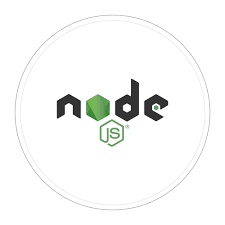

## Hi there 👋

  

 

 
 
 
 

 
 
 
 
 
 
 
 
 
 
 
 
 
 
 
 

- 🔭 I’m currently working on Salesforce development
- 👯 I’m looking to collaborate on open source projects
- 💬 Ask me about anything that you want to learn

<!--

**klcysn/klcysn** is a ✨ _special_ ✨ repository because its `README.md` (this file) appears on your GitHub profile.

Here are some ideas to get you started:

- 🔭 I’m currently working on programming languages
- 🌱 I’m currently learning Salesforce and Marketing Cloud
- 👯 I’m looking to collaborate on open source projects
- 💬 Ask me about anything
- 📫 How to reach me: Gmail(klc.ysn19@gmail.com)
-->
